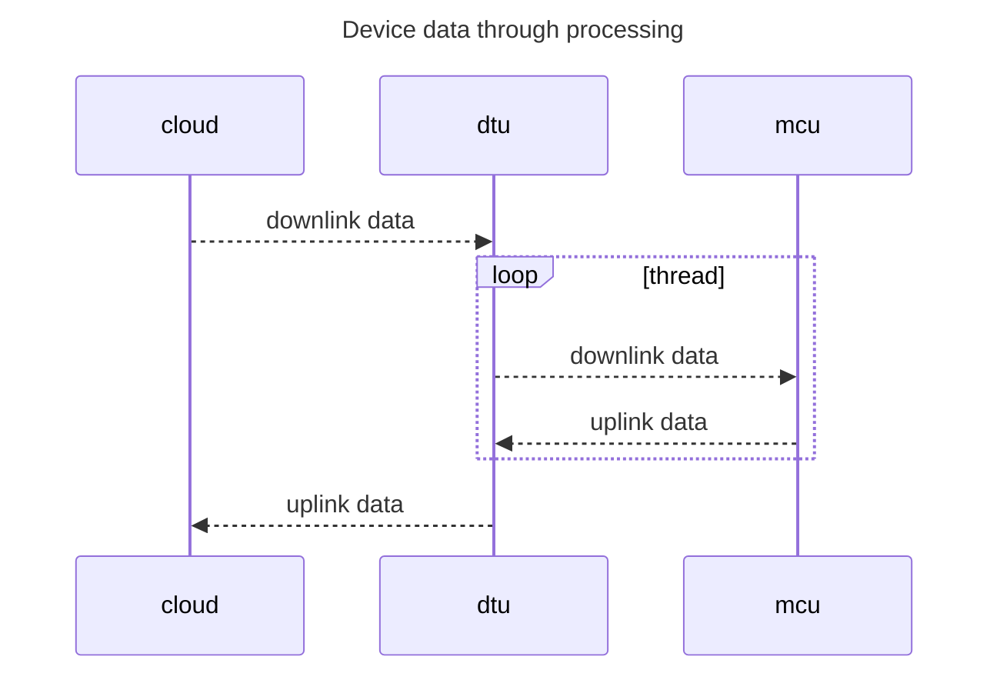

# Minimal DTU

## 概述

### 简介

**Minimal DTU**是一个轻量级的数据透传单元，仅包含串口数据通过DTU模组透传至TCP服务器。本文档主要说明基于**QuecPython**平台的**Minimal DTU**的使用方式。

### 目录结构

```txt
- code
	- dev.json  # 工程配置文件
	- led.py    # led灯控制模块
	- logging   # 日志模块
	- serial.py # 串口读写模块
	- socket.py # socket客户端
	- threading.py # 线程及线程同步模块
	- dtu.py    # DTU应用主模块
```

### 配置文件

配置文件采用json格式：`dev.json`，字段详解如下：

```python
{
    "PROJECT_NAME": "QuecPython_DTU_DEMO",  # 项目名称（自定义）
    "PROJECT_VERSION": "1.0.0",  # 项目版本（自定义）
    "SERVER": {
        "host": "220.180.239.212",  # 服务器ip或域名
        "port": "8305",  # 服务器端口号
        "timeout": 5,  # tcp read timeout seconds
        "keep_alive": 5  # tcp保活包周期(分钟)
    },
    "UART": {
        "port": 2,  # QuecPython平台串口GPIO号
        "baudrate": 115200,  # 波特率
        "bytesize": 8,  # 数据位
        "parity": 0,  # 奇偶校验
        "stopbits": 1,  # 停止位
        "flowctl": 0  # 流控
    },
    "LED": {
        "GPIOn": 16  # QuecPython平台GPIO号
    }
}
```

## 操作演示

接下来我们使用搭载了`EC200U`模组的开发板`QuecPython_EC2X_EVB_V2.0`(EC2X开发板介绍：https://python.quectel.com/doc/Quick_start/zh/EC2X_BOARD.html)来做演示。

如下图所示，设备使用type-c给模块供电，UART与TTL转USB模块连接至开发电脑，可轻松实现调试。


| 开发板上的PIN脚 | TTL转USB模块 | 图中线的颜色 |
| --------------- | ------------ | ------------ |
| J7的13脚(TX)    | RX           | 红线         |
| J7的14脚(RX)    | TX           | 橙线         |
| J7的3脚(GND)    | GND          | 黄线         |

更多开发板请参阅：<https://python.quectel.com/doc/Quecpython_intro/zh/Qp_Product_intro/Hardware_Support.html>。

### 拉取代码

访问github仓库: <https://github.com/QuecPython/minimal_DTU>，选择下图`Download ZIP`下载主分支最新代码。


### 修改配置文件

代码目录`code`下`dev.json`即为配置文件，如下图所示，根据实际修改其中的`SERVER`（TCP服务器ip、域名和端口号）和`UART`（串口配置参数）配置项。


### 调试

安装QPYCom以及搭建QuecPython开发环境参考文档：https://python.quectel.com/doc/Quick_start/zh/index.html。

#### 打开repl串口


#### 下载脚本

创建下载项目 —— 切换到下载选项卡，点击创建项目，并输入任意项目名称。

此处我们创建名为`DTU`的项目。


选择导入文件 —— 右击`usr`目录，在弹出的选择框中点击**一键导入**，继而选择我们DTU代码仓库中的**code**文件夹 —— 即将code中的所有代码一键导入至模组。如下图所示：


导入脚本 —— 点击右下角`下载脚本`按钮，即可开始导入脚本。

#### 运行DTU应用

切换至"File"选项卡，在右边选中"dtu.py"，点击运行按钮，即可开始dtu调试运行。

> 如果需要上电自动运行，只需要将"dtu.py"更名为"main.py"即可实现上电自动运行。


观察启动日志输出，如下图：


#### 数据透传

使用串口调试工具打开配置文件中指定的串口。模拟发送数据透传。

本文档使用的是echo服务器，即发送数据即刻回显。在当前DTU演示案例中的数据具体流向如下：

1. 通过串口调试工具发送串口数据。
2. 设备在收到数据后透传给tcp服务器。
3. tcp服务器在收到数据后回传数据。
4. 设备在收到回传数据后立刻转发至串口。
5. 串口调试工具界面可观察到透传的下行数据。


## 应用指导

### 初始化流程

参阅`code/dtu.py`

```python
if __name__ == '__main__':
    # strep1: initialize DTU Object
    dtu = DTU('Quectel')

    # step2: read json configure from json file
    dtu.config.from_json('/usr/dev.json')

    # step3: poweron print once
    checknet = checkNet.CheckNetwork(
        dtu.config['PROJECT_NAME'],
        dtu.config['PROJECT_VERSION'],
    )
    checknet.poweron_print_once()

    # step4: check network until ready
    while True:
        rv = checkNet.waitNetworkReady()
        if rv == (3, 1):
            print('network ready.')
            break
        else:
            print('network not ready, error code is {}.'.format(rv))

    # step5: dtu application run forever
    dtu.run()
    # in run method, we has below acitons:
    # step5.1: open serial
    # step5.2: connect to tcp server
    # step5.3: start up/down link thread
```

### DTU数据流

**Minimal DTU**作为一款简单的数据传输单元，仅支持串口数据纯透传TCP服务器模式。



应用有2个核心线程：**上行数据处理线程**、**下行数据处理线程**：

- 上行数据处理函数`uplink_transaction_handler`中负责读取串口数据转发TCP服务器。
- 下行数据处理函数`down_transaction_handler`中负责读取TCP数据转发串口。

> 这两个线程函数均在DTU类中定义，详情请参阅类中定义。

## 文档汇总

| 文档描述                                  | 链接                                                         |
| ----------------------------------------- | ------------------------------------------------------------ |
| QuecPython官网wiki(包含各种api供开发使用) | https://python.quectel.com/doc/API_reference/zh/index.html   |
| QuecPython入门开发教程                    | https://python.quectel.com/doc/Quick_start/zh/index.html     |
| 资源下载(固件、工具、驱动等)              | https://python.quectel.com/download                          |
| DTU产品介绍                               | https://python.quectel.com/doc/Product_case/zh/dtu/DTU_Product_Introduction.html |
| EC2X开发板介绍                            | https://python.quectel.com/doc/Quick_start/zh/EC2X_BOARD.html |
| EC200U-CN模组介绍                         | https://python.quectel.com/products/ec200u-cn                |

## 常见问题

1、串口通信问题。

> Q: 通过TTL转USB模块连接串口至PC后，QCOM串口调试工具无法接收、发送数据。
>
> A: 通常可以采用如下方式检查：
>
> - 检查QCOM是否选择正确的端口打开。
> - 检查接线是否正确，模组RX接TTL转USB设备的TX，模组TX接TTL转USB设备的RX。
> - 应用代码配置的QuecPython串口编号选择是否正确。参阅：`https://python.quectel.com/doc/API_reference/zh/QuecPython_classlib/machine.UART.html`中针对不同的模组，开放的UART列表 。

2、网络问题

> Q: 连接网络异常。
>
> A：可以通过`checkNet`的`waitNetworkReady`函数返回值判定，返回值代表含义详情参阅：`https://python.quectel.com/doc/API_reference/zh/QuecPython_classlib/checkNet.html`