# Minimal DTU

[[简体中文](./README_ZH.md)]

## Overview

### Introduction

**Minimal DTU** is a lightweight data transparent transmission unit that only involves forwarding serial port data through a DTU module to a TCP server. This document primarily explains the usage of **Minimal DTU** based on the **QuecPython** platform.

### Directory Structure

```txt
- code
	- dev.json  # Project configuration file
	- led.py    # LED control module
	- logging   # Logging module
	- serial.py # Serial port read and write module
	- socket.py # Socket client
	- threading.py # Thread and thread synchronization module
	- dtu.py    # Main module for DTU application
```

### Configuration File

The configuration file is in JSON format: `dev.json`, and the fields are explained as follows:

```json
{
    "PROJECT_NAME": "QuecPython_DTU_DEMO",  # Project name (customized)
    "PROJECT_VERSION": "1.0.0",  # Project version (customized)
    "SERVER": {
        "host": "220.180.239.212",  # Server IP address or domain name
        "port": "8305",  # Server port number
        "timeout": 5,  # TCP read timeout seconds
        "keep_alive": 5  # TCP keep-alive packet interval (minutes)
    },
    "UART": {
        "port": 2,  # QuecPython platform UART GPIO number
        "baudrate": 115200,  # Baud rate
        "bytesize": 8,  # Data bits
        "parity": 0,  # Parity (0 for None, 1 for Odd, 2 for Even)
        "stopbits": 1,  # Stop bits
        "flowctl": 0  # Flow control (0 for None, 1 for RTS/CTS)
    },
    "LED": {
        "GPIOn": 16  # QuecPython platform GPIO number for LED
    }
}
```

## Operation Demonstration

Next, we will demonstrate using the development board [QuecPython_EC2X_EVB_V2.0](https://python.quectel.com/doc/Getting_started/en/evb/ec2x-evb.html) which is equipped with the `EC200U` module.

As shown in the figure below, the device is powered by Type-C, and UART is connected to the development computer via a TTL to USB module, making debugging easy.

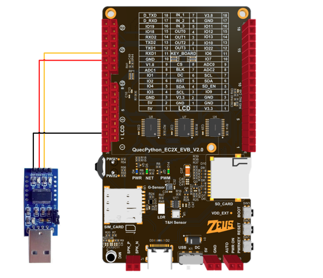

| Development Board PIN | TTL to USB Module | Cable Color in the Image |
| --------------------- | ----------------- | ------------------------ |
| J7 Pin 13 (TX)        | RX                | Red Cable                |
| J7 Pin 14 (RX)        | TX                | Orange Cable             |
| J7 Pin 3 (GND)        | GND               | Yellow Cable             |

### Pulling the Code

Visit the GitHub repository: https://github.com/QuecPython/minimal_DTU, and choose the "Download ZIP" option as shown below to download the latest code from the main branch.

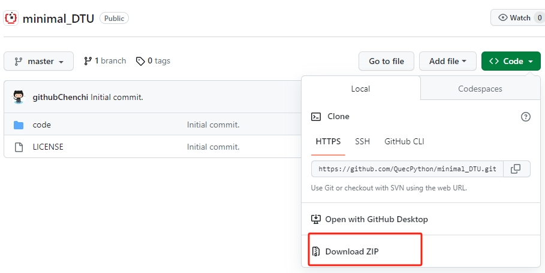

### Modifying the Configuration File

The configuration file is located in the `code` directory, named `dev.json`. As shown in the image below, modify the `SERVER` (TCP server IP, domain, and port) and `UART` (serial port configuration parameters) sections according to your actual setup.

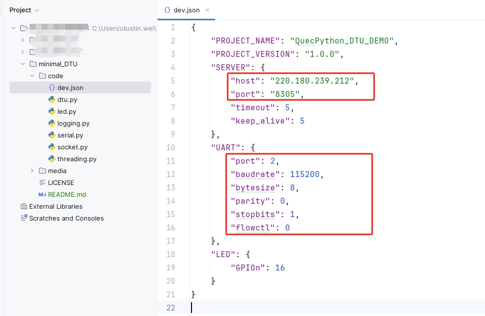

### Functional Debugging

Refer to the [Quick Start](https://python.quectel.com/doc/Getting_started/en/) documentation for setting up the development environment:

- Driver [Download and Installation](https://python.quectel.com/doc/Getting_started/en/driver_prepare.html)
- QPYCom [Download](./media/qpycom_download.png) and [Usage](https://python.quectel.com/doc/Application_guide/en/dev-tools/QPYcom/index.html)

#### Open the REPL Serial Port

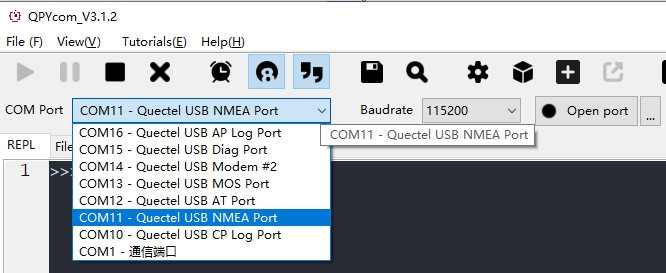

#### Download Script

**Create Download Project**

Switch to the download tab, click the `Create` button, and enter any project name.

Here, we'll create a project named `DTU`.

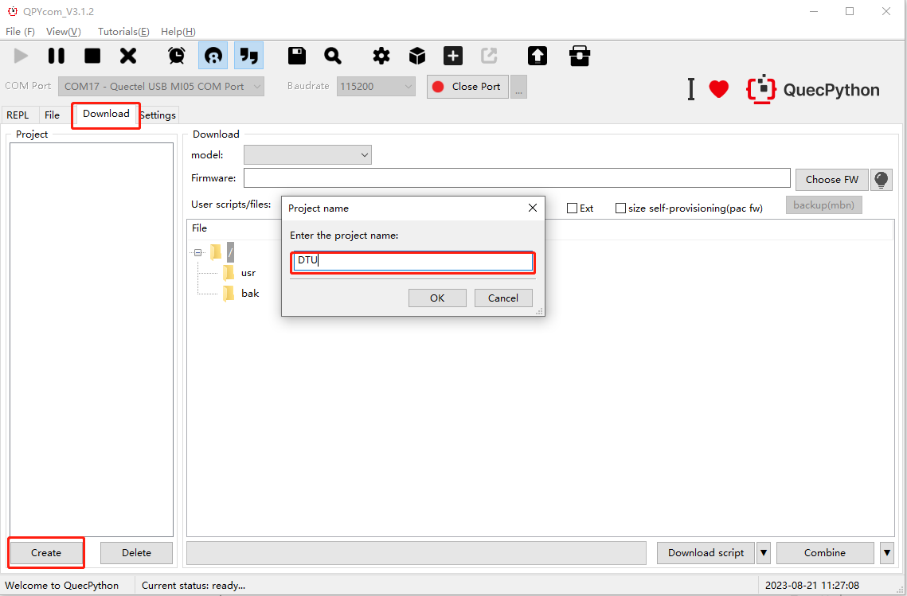

**Select Script Files**

1. Right-click on the `usr` directory and choose `One click import` from the menu options.
2. Choose the `code` folder from our DTU project and click the `OK` button. As shown in the figure below:

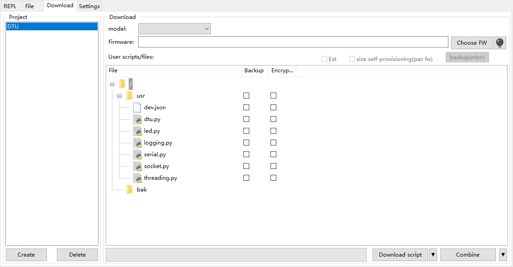

**Import Script Files**

Click the `Download script` button in the bottom right corner to start importing the script files.

#### Run DTU Application

Switch to the `File` tab, select `dtu.py` on the right, and click the run button to start debugging the DTU application.

> If you want it to run automatically on power-up, simply rename `dtu.py` to `main.py`. This ensures that the script runs automatically when the device is powered up.

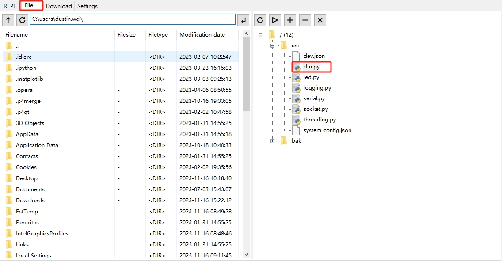

Observing the startup log output, as shown in the figure below:

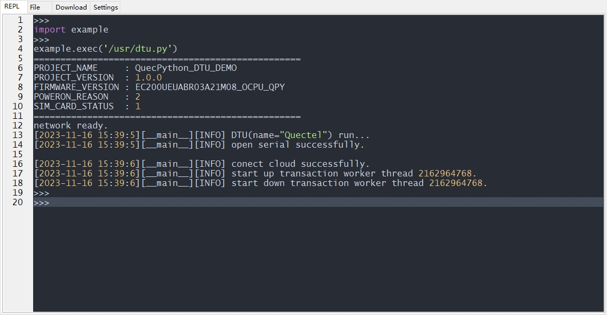

#### Data Passthrough

Use a serial debugging tool to open the serial port specified in the configuration file. Simulate sending data passthrough.

In this document, an echo server is used, which means that the data is immediately echoed upon sending. The specific flow of data in the current DTU demonstration case is as follows:

1. Send serial data through the serial debugging tool.
2. The device passthrough the received data to the TCP server.
3. The TCP server sends back the data upon receiving it.
4. The device immediately forwards the received data to the serial port.
5. The serial debugging tool interface can observe the passthrough downstream data.

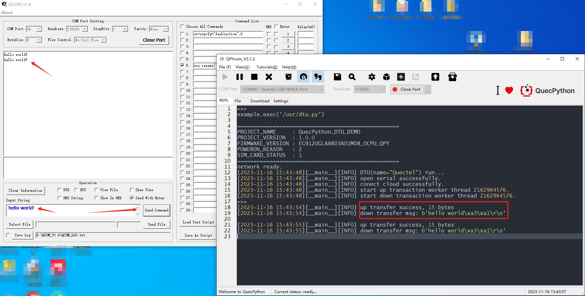

## Application Guide

### Initialization Process

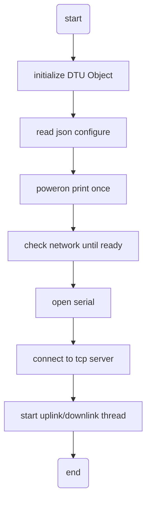


Refer to `code/dtu.py` for the initialization process.

```python
if __name__ == '__main__':
    # strep1: initialize DTU Object
    dtu = DTU('Quectel')

    # step2: read json configure from json file
    dtu.config.from_json('/usr/dev.json')

    # step3: poweron print once
    checknet = checkNet.CheckNetwork(
        dtu.config['PROJECT_NAME'],
        dtu.config['PROJECT_VERSION'],
    )
    checknet.poweron_print_once()

    # step4: check network until ready
    while True:
        rv = checkNet.waitNetworkReady()
        if rv == (3, 1):
            print('network ready.')
            break
        else:
            print('network not ready, error code is {}.'.format(rv))

    # step5: dtu application run forever
    dtu.run()
    # in run method, we has below acitons:
    # step5.1: open serial
    # step5.2: connect to tcp server
    # step5.3: start up/down link thread
```

### DTU Data Flow

**Minimal DTU**, as a simple data transmission unit, supports pure serial data passthrough in TCP server mode only.

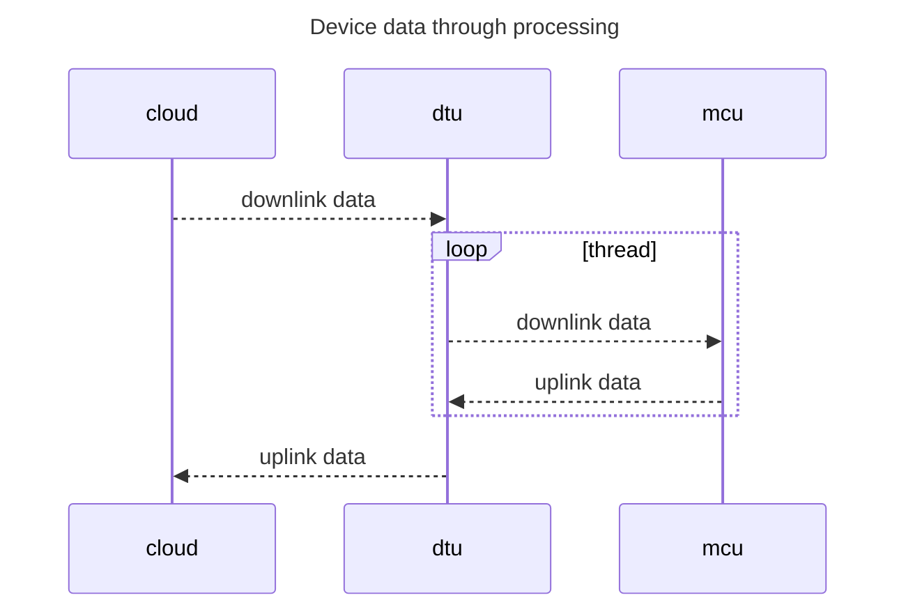

The application consists of two core threads: the **uplink data processing thread** and the **downlink data processing thread**:

- The `uplink_transaction_handler` function in the uplink data processing thread is responsible for reading serial data and forwarding it to the TCP server.
- The `down_transaction_handler` function in the downlink data processing thread is responsible for reading TCP data and forwarding it to the serial port.

## Documentation Summary

| Document Description         | Link                                                         |
| ---------------------------- | ------------------------------------------------------------ |
| QuecPython API Reference     | https://python.quectel.com/doc/API_reference/en/index.html   |
| QuecPython Getting Started   | https://python.quectel.com/doc/Getting_started/en/           |
| Resource Downloads           | https://python.quectel.com/en/download                       |
| EC2X Development Board Guide | https://python.quectel.com/doc/Getting_started/en/evb/ec2x-evb.html |
| EC200U-EU Module Overview    | https://python.quectel.com/en/products/ec200u-eu             |

## FAQ

1. **Unable to receive/send data through QCOM serial debugging tool after connecting the serial port to the PC via TTL to USB module.**

    > Usually, you can check the following:
    >
    > - Ensure that QCOM has selected the correct port.
    > - Check if the wiring is correct, where the module's RX is connected to the TTL to USB device's TX, and the module's TX is connected to the TTL to USB device's RX.
    > - Verify if the QuecPython UART number configured in the application code is correct. Refer to: <https://python.quectel.com/doc/API_reference/en/QuecPython_classlib/machine.UART.html> for the UART list available for different modules.

2. **Network connection issues.**

    > You can determine the network status by checking the return value of the `waitNetworkReady` function in the `checkNet` module. For details on return values, refer to: <https://python.quectel.com/doc/API_reference/en/QuecPython_classlib/checkNet.html>.